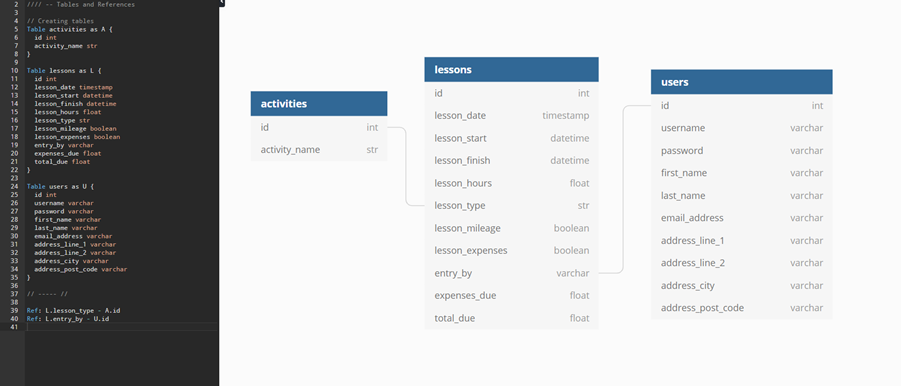

# Norfolk Snowsports Club (NSC) Volunteer Hours website

## Python and Data Centric Development Milestone Project.

---

This site has been created to reduce the amount of admin work at Norfolk Snowsports Club and allow instructors a place where they can see their current expenses due and hours volunteered.

---
---

## Table of contents

---

- [UX](#ux)
    - [Project Goals](#project-goals)
    - [User Goals](#user-goals)
    - [User Stories](#user-stories)
    - [Wireframes](#wireframes)
    - [Surface](#surface)
- [Backend](#backend)
    - [Database](#database)
    - [Database Schema](#database-schema)
    - [MongoDB](#mongodb)
- [Features](#features)
    - [Navigation Bar](#navigation-bar)
    - [Home Page](#home-page)
    - [Future Features](#future-features)
- [Technologies used](#technologies-used)
- [Testing](#testing)
    - [Functionality Testing](#functionality-testing)
    - [Compatibility Testing](#compatibility-testing)
    - [User Story Testing](#user-story-testing)
    - [Issues and bugs](#issues-and-bugs)
    - [Performance Testing](#performance-testing)
    - [Code Validation](#code-validation)
- [Deployment](#deployment)
- [Credits](#credits)
    - [Learning resources and styling ideas](#learning-resources-and-styling-ideas)
    - [Code](#code)
    - [Images Used](#images-used)
- [Other Information](#other-information)
- [Project Screenshots](#project-screenshots)

---
---

## UX

---

### Project goals

The primary goal of the NSC Volunteer Hours website is to reduce the amount of admin work needed when volunteer instructors submit their hours at Norfolk Snowsports Club, NSC. Currently instructors complete a lesson, write their hours in a daily log then this in manually input onto an access database and an excel sheet. The expenses are then caluclated, printed and sent to accounts for accounts to type the information into their excel sheets. This site will allow instructors to enter their details and their expenses will automatically be calculated saving hundreds of hours a year in admin time.

The secondary goal is to provide instructors a place where they can easily see their recent hours worked, their expenses due and their freetime accrued. Typically instructors can only see this information once every three months when their expenses statements are print but this site will allow them live view of all their record hours at any one time.

### User goals

#### User goals:

The users will be volunteer ski and snowboard instructors and coaches.

* Users can add the lessons they have completed.
* Users can see the lessons they have added.
* Users can update and delete the lessons they have added.
* Users can Search for lesson by their type/category.

#### Site Admins Goals:

The site admin will be NSC employees.

* Admin can view, edit and delete any and all lessons input by instructors.
* Admin can add new records of lessons on an instructors behalf.
* Admin can add new lesson types/categories and edit existing ones.
* Admin can view and edit users.

### User Stories

#### As an instructor I would like to:

* Easily add lessons I have done to the NSC Volunteer Hours Site.
* View all my lessons volunteered.
* Edit and delete any records I have incorrectly added.
* See an overview of the hours I have volunteered and the expenses due.
* Manage my account information.

#### As an Admin User I would like to:

* View all submitted hours.
* Edit and delete any records that are incorrect.
* See an overview of all hours and expenses.
* Easily search for a user or a lesson type/category.
* Edit user information.
* Add and Edit new and existing lesson types/categories.
* Input lesson information on an instructors behalf.

### Wireframes

I used [Balsamiq.com](https://balsamiq.com/) to create the wireframes.

### Surface

#### Colours

Main colours used in project:

* Primary colour one - HEX: #202945, RGB: R: 32 G: 41 B: 69
* Primary colour two - HEX: #ce0e2d, RGB: R: 206 G: 14 B: 45
* Secondary colour one - HEX: #fff, RGB: R: 255 G: 255 B: 255
* Secondary colour two - HEX: #cbd514, RGB: R: 203 G: 213 B: 20

#### Fonts

* Primary font - 'Work Sans' was chosen as this is part of Norfolk Snowsports Clubs brand image and this is a clear, easy to read font.
* Secondary font - 'Ubuntu' was chosen as this is part of Norfolk Snowsports Clubs brand image and tis is also a clear, easy to read font.
* Back-up font - 'sans-serif' chosen as a back-up to the primary and secondary fonts for is wide acceptability accross platforms and it's clear, easy to read properties.

The above fonts are perfect for a website aimed at staff/volunteers. The users are here to input thier lesson not see overly fancy, difficult to read font.

#### Images & logos

No images as such have been used for this website as this site is intend as a site for staff and volunteers therefore by reducing distractions this will increase efficiency.

The Norfolk Snowsports Club Logo has been used and this is linked in the header of the base.html file.

Back to [Table of Contents](#table-of-contents)

---
---

## Backend

---

### Database

The database, volunteer_hours, consists of 3 collections:

* Users - used to store users personal details and login information.
* Lessons - used to store all submitted lesson records.
* Activities - used to store all submitted activity types.

### Database Schema

The Lessons collection is linked to the users collection from the lesson entry_by to user id and the lessons collection is linked to the activities collection from the lesson lesson_type to the activites id.

### MongoDB

Mongo Db was chosen as it is user friendly, easy to use and supports non ralational databases.

Back to [Table of Contents](#table-of-contents)

---
---

## Features

---

This website consists of 13 pages using templating language to load these inside the base.html page. The website pages and features are as follows:

### Navigation bar

* The navigation bar is fixed at the top of every page so user can easily navigate between the pages and have a point of reference.
* The site logo acts as a home button returning users to the home page when clicked.
* For smaller screen sizes the navbar links will collapse into a hamburger menu which is expected amungst most mobile sites now.
* Admin user will have a couple of different navbar links appear/change that normal users can't see allowing them to access pages only used for admin.

### Footer

* The footer shows information include contact details, address and copyright info.
* The footer has links to the clubs social media sites.
* Club website is also linked in the footer and can also be clicked.
* All external links open in new tabs.

### Home Page

#### About This Site Section

* The about us section has a small amount of information about how expenses are calculated and a brief description of why this site was created.

#### Contact us Section

* This allows users to contact admin staff with questions.
* Form responds to user input.
* The form has an alert that informs the user that their message has been sent.
* The form will also display a message if an input isn't accepted and why.

### Login Page

* Clear easy to understand login page that accepts correct username and password combination.
* Flash message displayed if username or password is wrong.
* Automatic redirect to profile page when username and password is correct.
* Flash message displayed when redirected to the profile page.
* The input fields will also display a message if an input isn't accepted and why.
* Call to action below login button for people who need to register. This can be clicked to link them to register page.

### Register Page

* Clear easy to understand register page that accepts takes a variety of personal details.
* The input fields will display a message if an input isn't accepted and why.
* Call to action below register button for people who need to login instead of register. This can be clicked to link them to login page.
* Automatic redirect to profile page when form is complete and button is clicked.
* Flash message displayed when redirected to the profile page.

### Profile Page

* Users information automatically populates the form fields.
* Username is displayed but cannot be edited to avoid any bugs that will be caused in the records pages.
* User password is hidden to avoid any chace of this being corrupted or recorded by a third party.

### Edit Profile Page

* Users information automatically populates the form fields making it easier and quicker to submit when small changes are made.
* Users usname is displayyed above so the user knows they're editing their profile.
* Automatic redirect to profile page when changes are submitted.
* Flash message displayed when edits are submitted.

### My Lessons Page

* Search bar to allow users to easily search the lesson type and user fields.
* Table displaying all input records.
* Functionality behing the table automatically calculates expenses due and displays these.
* Edit button which directs the user to the edit record page.
* Delete button to allow users to delete their own records.
* Delete button has an alert to confirm if the user wishes to delete the record.
* For smaller screen sizes the table becomes scrollable so the information doesn't have to be push together and so the user doesn't have to move the entire page.

### New Record Page

The user doesn't need to type anything making this information easier to input, reducing human error and making this app much more mobile friendly.

* New record page allows user to easily input their lesson information.
* Appropriate icons to assist with the readability of the form.
* Lesson date allows users to select the date from a callender so this does not have to be typed.
* Lesson start and finish times allow users to select a time from a clock so this does not have to be typed.
* Hours and lesson type input fields both have drop downs allowing the user to select the correct option without having to type anything.
* Switches used for mileage and expenses which allow the user an easy way of claiming this expenses.
* Expenses? field starts on as most people claim this and Mileage? is off as not as many people claim this.
* Automatic redirect to lessons page when record is submitted.
* Flash message displayed when record is submitted o inform user that record has been added.

### New Record Admin Page

This has all of the above features from New Record Page and the following:

* Only accessable by Admin user.
* Allows the admin user to input the username of the instructor whos lesson the record relates to.

### Edit Record Page

* Lesson information automatically populates the form fields making it easier and quicker to submit when small changes are made. This also reasures the user they are editing the correct record.
* Automatic redirect to lessons page when changes are submitted.
* Flash message displayed when edits are submitted.

### Site Manager Page

* This page also admin user to add new activities and edit current activities.
* No delete option to avoid any potential data corrupiton.
* Statistics section displaying a total of hours, expense and mileage.
* User profile section where admin can see all user and edit.

### New Activity Page

* Clear easy to understand new activity page that allows users to add an activity.
* Automatic redirect to site manager page when activity is submitted.
* Flash message displayed when activity is submited

### Edit Activity Page

* Clear easy to understand edit activity page that allows users to edit an activity.
* Automatic redirect to site manager page when edit is submitted.
* Flash message displayed when edit is submited.

### Future Features

* Allow admit to edit home page from the site manager page use templating.
* Confirm password field when users are registering to ensure the correct password was input.
* Back end checks to check the session user is indeed admin so the pages can't be broken into as easily.
* Seperate lessons on the lesson table by month, quarter and year.
* Provide statistics for the totals of lesson values for month, quater and year.
* Compare month on month, quarter on quarter and year on year values in site manager page.
* Allow users to email themselves a table of their records.
* Input accurate mileage figures and have this calculated in the table.
* Show a record of expenses per user.

Back to [Table of Contents](#table-of-contents)

---
---

## Technologies used

---

#### HTML5

* Used as a structural language.

#### CSS

* Used as a style language.

#### JavaScript

* Used JavaScript as a scripting language.

#### Python

* Used Python as a programming language.

#### Font Awesome

* [Font Awesome](https://fontawesome.com/) was used for social links, skiing and snowboarding headings and for table headings.

#### Google Fonts

* [Google Fonts](https://fonts.google.com/) used as a font resource.

#### GitHub

* [GitHub](https://github.com/) was used as the site's repository.

#### Materialize

* [Materialize](https://materializecss.com/) was used as a framework.

#### Gitpod

* [Gitpod](https://gitpod.io/workspaces/) was used as a development hosting platform.

#### Heroku

* [Heroku](https://www.heroku.com/) was used as a cloub application platform.

#### MongoDB

* [MongoDB]() was used as a cloud database.

#### Wireframes

* [Balsamiq.com](https://balsamiq.com/) was used as a wireframe tool to sketch the structure of the site.

#### DBDiagram

* [DBDiagram](https://dbdiagram.io/home) was used to build the sites database schema.

Back to [Table of Contents](#table-of-contents)

---
---

## Testing

---

### Functionality Testing

### Compatibility Testing

### User Story Testing

### Issues and bugs

### Performance Testing

### Code Validation

Back to [Table of Contents](#table-of-contents)

---
---

## Deployment

---

Back to [Table of Contents](#table-of-contents)

---
---

## Credits

---

To complete this project I used Code Institute student template: [gitpod full template](https://github.com/Code-Institute-Org/gitpod-full-template)

### Learning resources and styling ideas

Throughout learning with code institute I have researched and learnt using the following sites and courses:

* [Code Institute](https://learn.codeinstitute.net/login?next=/dashboard)
    * Throughout this project I have referred back to lots of different modules to refresh myself on good practices.
* [W3Schools](https://www.w3schools.com/)
    * I have used this site throughout the course when looking for ideas or potential stylings to code.

### Code

### Images Used

Back to [Table of Contents](#table-of-contents)

---
---

## Other information

---

Back to [Table of Contents](#table-of-contents)

---
---

## Project Screenshots

---

Back to [Table of Contents](#table-of-contents)

---
---